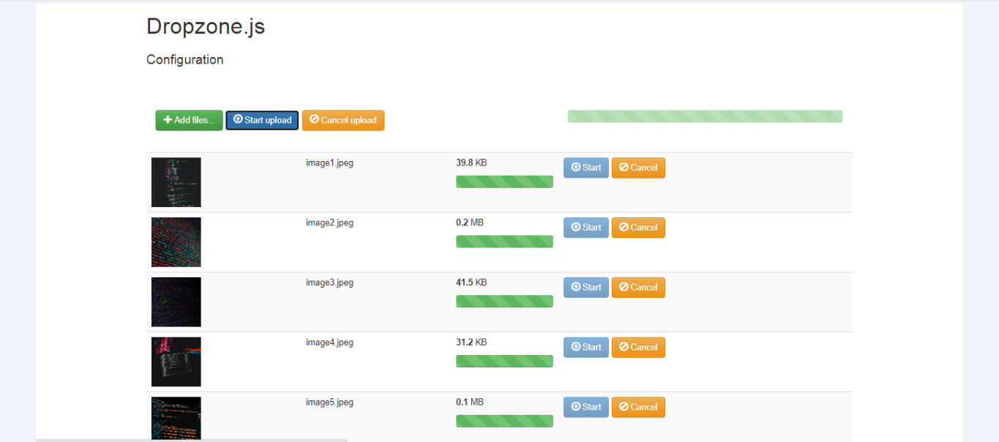

<h1> 
 CA4106 - Cloud Computing Assignment 
 </h1>
<h3> 
 https://imageupload.soren.dreano.net/ 
 </h3>

  

<h2> Project Description </h2>

 The aim of the assignment was to use the Boto3 documentation to create a Python application which creates an AWS S3 bucket and uploads 5 images to this bucket. A new browser window should then be opened showing the images in this S3 bucket. 

 We decided to take the assignment a step further and develop a hosted web application using Flask, Python, Javascript, HTML, and DropZone.js which is an open-source Javascript library. This enabled us to create a website where images could be uploaded through the use of drag and drop and have their thumbnail / previews displayed before being uploaded along with the file size. When the ‘Start Upload’ button is pressed a loading bar is shown beside each of the images and a total loading bar at the top of the screen. Once the images have been uploaded the S3 bucket is automatically opened in a new window and the images are shown. 

 We decided to host the application on a Virtual Private Server (VPS) which uses Transport Layer Security (TLS) encryption which is a protocol used for encrypting web traffic. This enabled us to ensure that users of the site had a secure connection and that there was a high level of data privacy and integrity during the file transfer. It also allowed us to have a HTTPS URL.

<h2> YouTube Video Demo </h2>
Link: needs to be added

